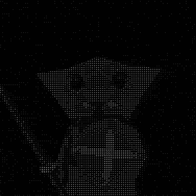

<div align="center">



# Ravi Arnan Irianto

**Cybersecurity enthusiast** focused on secure web development, threat analysis, and practical security research.

Teknologi Informasi '23 at Universitas Udayana, Denpasar, Bali

<br />

[](https://raviarnan.netlify.app)
[](https://instagram.com/ravi_arnan)
[](https://github.com/ravi-arnan)

</div>

---

### About

- Building things on the web and breaking them on purpose to learn how to keep them safe.
- Interested in web application security, threat analysis, and secure-by-default development.
- Comfortable across the stack: from React and Next.js front ends to Node.js APIs, Docker, and Linux.
- Always experimenting with new tools and writing about what I find.

### Focus Areas

```text
Secure Web Development   ->   auth, input validation, hardening, OWASP Top 10
Threat Analysis          ->   reconnaissance, log review, attack-surface mapping
Security Research        ->   labs, CTFs, write-ups, proof-of-concepts
```

### Tech Stack

<div align="center">

[](https://github.com/tandpfun/skill-icons)

</div>

### GitHub Stats

<div align="center">


</div>

---

<div align="center">

<sub>Secure by default. Curious by nature.</sub>

</div>
